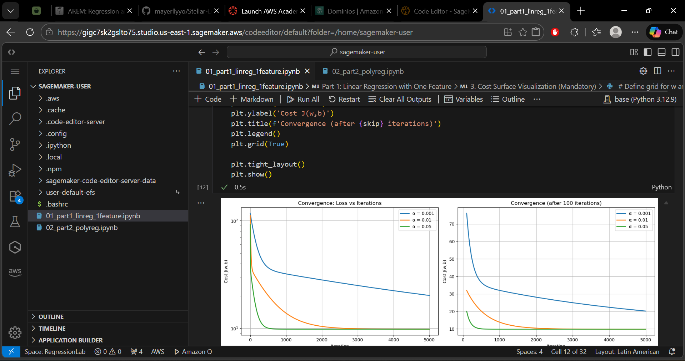
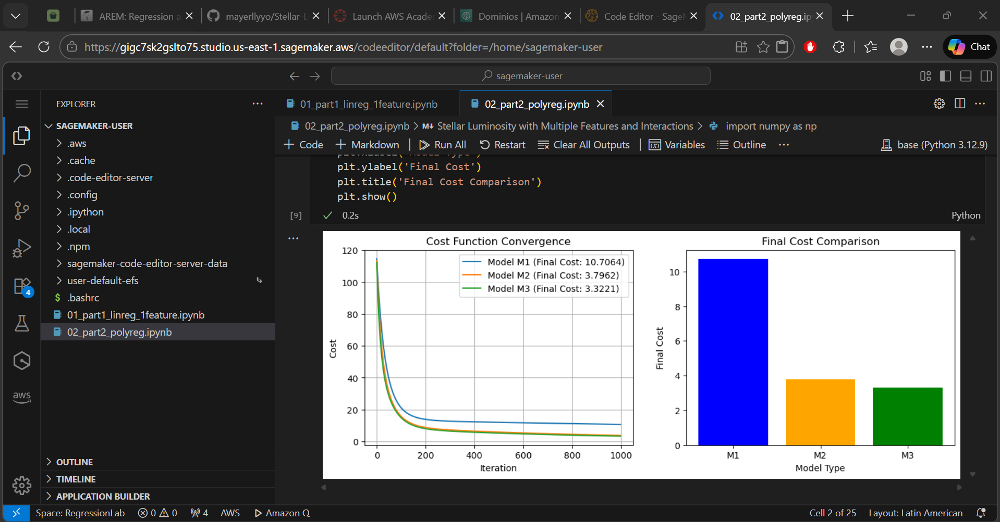

# Stellar Luminosity Regression

**Machine Learning Bootcamp - Digital Transformation and Enterprise Architecture**

Implementation of linear and polynomial regression from first principles for stellar luminosity modeling.

## Project Overview

This project implements regression models to predict stellar luminosity based on mass and temperature, building everything from first principles without using ML libraries like scikit-learn.

## Getting Started

These instructions will allow you to run the project locally and reproduce all experiments, visualizations, and results presented in the notebooks.
The project consists of two Jupyter notebooks covering linear regression with one feature and polynomial regression with multiple features.

## Prerequisites

To run this project, you need the following software installed:

- Python 3.x
- Jupyter Notebook
- NumPy
- Matplotlib

You can install the required Python libraries using pip:

```bash
pip install numpy pandas 
```

## Installing

Follow these steps to set up the development environment:

1. Clone the repository:
    ```bash
    git clone https://github.com/mayerllyyo/Stellar-Luminosity-Regression
    ```
2. Navigate into the project directory:
    ```bash
    cd Stellar-Luminosity-Regression
    ```
3. Open and run the notebooks in order:
    ```
    01_part1_linreg_1feature.ipynb
    02_part2_polyreg.ipynb
    ```
After running all cells, you will obtain cost surface plots, convergence graphs, residual analysis, and model comparison results for stellar luminosity prediction.

## Running the tests

This project is educational and exploratory in nature and does not include automated unit tests.
Validation is performed through numerical convergence checks, visual inspections, and comparison of loss values across models.

### Break down into end to end tests

End-to-end validation consists of running each notebook from start to finish and verifying that:

* Gradient descent converges
* Loss decreases monotonically for appropriate learning rates
* Plots and visualizations are generated correctly
* Polynomial models outperform the linear baseline

Example:

```python
# Check that loss decreases over iterations
plt.plot(J_history)
plt.xlabel("Iterations")
plt.ylabel("Cost")
```

### And coding style tests

Coding style validation is manual and focuses on:

* Clear variable naming
* Step-by-step implementation of algorithms
* Separation between data preparation, model logic, and visualization
* Use of vectorized NumPy operations where appropriate

Example:

```python
dw = (2/n) * X.T @ error
db = (2/n) * np.sum(error)
```

## Deployment

This project was executed both locally and in the cloud using AWS SageMaker.

The notebooks were run on a low-cost instance (ml.t3.medium) with the Python 3.12.9 kernel. Due to network restrictions on this instance type, cloning the GitHub repository directly is not possible.

### Git Clone Limitation

Attempting to clone the repository results in the following error:

```bash
sagemaker-user@default:~$ git clone https://github.com/mayerllyyo/Stellar-Luminosity-Regression
Cloning into 'Stellar-Luminosity-Regression'...
fatal: unable to access 'https://github.com/mayerllyyo/Stellar-Luminosity-Regression/': Failed to connect to github.com port 443 after 132287 ms: Connection timed out
```
This happens because ml.t3.medium instances do not have unrestricted internet access, so cloning via HTTPS is not allowed.

### Deployment steps in SageMaker:

1. Access AWS SageMaker Studio
2. Create a notebook instance (ml.t3.medium)
3. Upload both `.ipynb` files
4. Select the base (Python 3.12.9) kernel
5. Run all cells

All plots and results were reproduced successfully without code changes.

### Evidence of Execution

**Notebook 1 Output**


**Notebook 2 Output**


 **Video Demonstration**
A video showing both notebooks running successfully in SageMaker:

<video controls src="assets/run_books_sagemaker.mp4" title="SageMaker Execution Demo"></video>

### Local vs SageMaker Execution

No differences were observed between local execution and SageMaker execution. All plots, outputs, and results were reproduced successfully.

## Built With

* [Python](https://www.python.org/) – Programming language
* [NumPy](https://numpy.org/) – Numerical computation
* [Matplotlib](https://matplotlib.org/) – Data visualization
* [Jupyter Notebook](https://jupyter.org/) – Interactive computing
* [AWS SageMaker](https://aws.amazon.com/sagemaker/) – Cloud execution environment

## Contributing

This project was developed as part of an academic assignment and is not open for external contributions.
However, suggestions and improvements are welcome for educational discussion.

## Author

- **Mayerlly Suárez Correa** [mayerllyyo](https://github.com/mayerllyyo)


## License

This project is licensed under the MIT License - see the [LICENSE](LICENSE) file for details
